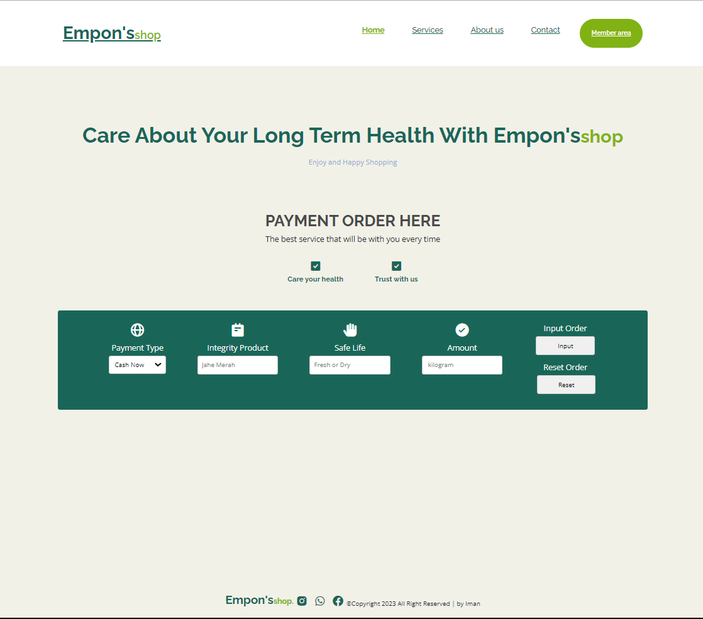
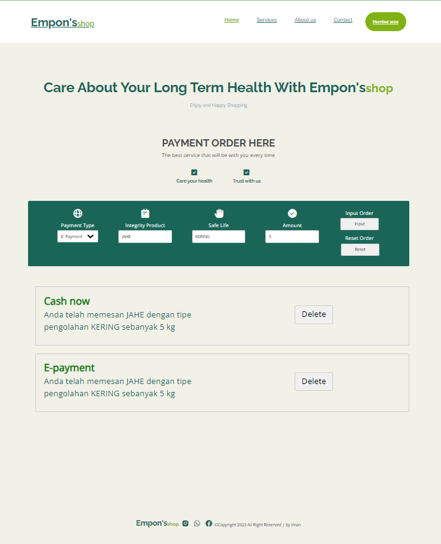

<h1>WEEKLY ASSIGNMENT - WEEK 7</h1>

<h2>About Week-7</h2>

Create an Interactive website app to input user's assets and track their assets. Study for apply typescript and DOM

 
  
    
  

  

### ---

<h2>Responsive Mode</h2>

<h3>Dekstop Mode</h3>

Dekstop mode use Dimension value from <b>991 px and up</b>
 @media screen and (max-width: 991px)

<h3>Tablet Mode</h3>

Tablet mode use Dimension with size resposivity in <b>810 x 1080</b> px.
 @media screen and (max-width: 780px)

<h3>Mobile Mode</h3>

Mobile mode use Dimension with size resposivity in <b>450 x 915</b> px.
 @media screen and (max-width: 450px)

### ---

<h2>Deployment</H2>

<h3> Content Deploy Use Netlify</h3>

The project has been successfully deployed using 

`you can check here` :arrow_right: [assignment-week7](https://marisiman-assignment7.netlify.app/)

---
<h5 style = "text-align : center">Thanks</h5> 

<i>`copyright 2023 by Iman`</i>
